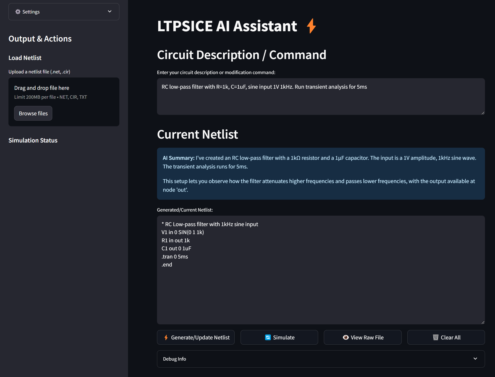
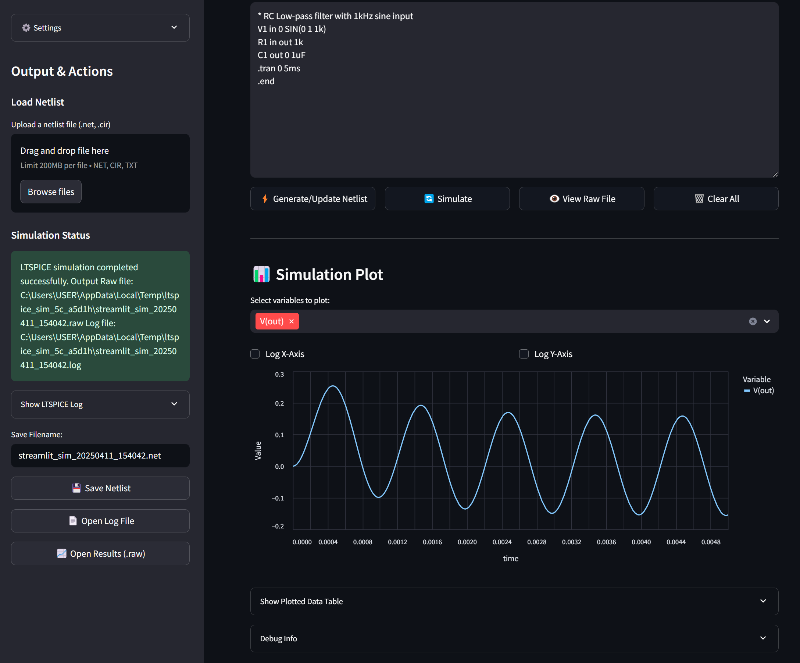

# LTspice AI Assistant

An AI-powered assistant to automate and enhance circuit simulations using LTspice. This project integrates Python scripting with Large Language Models (LLMs) to streamline the workflow of creating, running, and analyzing SPICE simulations.

[](https://github.com/kongpop10/LTSPICE-AI)


---

## Features

- **Automate LTspice Simulations**: Run LTspice simulations programmatically from Python.
- **Parse Simulation Results**: Extract and analyze waveform data from LTspice `.raw` files.
- **LLM Integration**: Use language models to generate SPICE netlists, analyze results, or assist with design.
- **Manage Settings**: Save and load user preferences for simulation workflows.
- **Interactive Interface**: User-friendly Streamlit interface for easy interaction.
- **File Management**: Load and save netlists with automatic file path detection.
- **Custom Directory Selection**: Browse and select directories for saving files.
- **Flexible File Extensions**: Save files with custom extensions or use the default .net extension.

---

## Project Structure

```
project-root/
├── ltspice-ai-assistant/
│   ├── app.py                 # Main entry point
│   ├── config.py              # Configuration management
│   ├── file_utils.py          # File handling utilities
│   ├── llm_interface.py       # Integration with language models
│   ├── ltspice_runner.py      # LTspice automation logic
│   ├── lt_icon.ico            # Application icon
│   ├── lt_icon.png            # Application icon (PNG format)
│   ├── prompts.py             # Prompt templates for LLMs
│   ├── raw_parser.py          # Parsing LTspice .raw files
│   ├── settings.json          # User configuration file
│   ├── settings_manager.py    # User settings management
│   └── __pycache__/           # Python cache files
└── saved_circuits/            # Storage for circuit files
```

---

## Installation

1. **Clone the repository**

```bash
git clone https://github.com/kongpop10/LTSPICE-AI.git
cd LTSPICE-AI
```

2. **Create and activate a virtual environment**

```bash
python -m venv venv
venv\Scripts\activate   # On Windows
# or
source venv/bin/activate  # On Linux/macOS
```

3. **Install dependencies**

```bash
pip install numpy scipy matplotlib pyltspice openai streamlit python-dotenv
```

4. **Configure Environment Variables**

Create a `.env` file in the project root with your API keys and configuration:

```
OPENROUTER_API_KEY=your_openrouter_api_key_here
OPENROUTER_API_BASE=https://openrouter.ai/api/v1
OPENROUTER_MODEL=openrouter/anthropic/claude-3-sonnet:beta
LTSPICE_PATH=C:\Program Files\ADI\LTspice\LTspice.exe
```

The application uses these environment variables to authenticate with the LLM API services and locate your LTspice installation. You can obtain an OpenRouter API key by signing up at [OpenRouter](https://openrouter.ai/).

5. **Configure LTspice Path**

Ensure LTspice is installed on your system. The path can be configured in three ways:
- In the `.env` file as shown above
- Update the path in the settings (`settings.json`)
- Via the assistant's settings interface in the sidebar

---

## Usage

Run the Streamlit interface (recommended):

```bash
streamlit run ltspice-ai-assistant/app.py
```

This will launch the web interface in your default browser. The interface provides:

- **Circuit Description**: Enter natural language descriptions to generate netlists
- **File Management**: Load and save netlists with automatic file detection
- **Simulation**: Run LTspice simulations directly from the interface
- **Visualization**: Plot and analyze simulation results
- **Settings**: Configure API keys, LTspice path, and other options

You can also integrate the modules into your own Python scripts for custom automation.

---

## Screenshots

### AI Response to Circuit Request

*The LTspice AI Assistant generates a netlist based on your natural language description and provides an AI summary of the changes made.*

### Simulation Results Visualization

*After running a simulation, the assistant displays the results in an interactive plot where you can select variables and customize the view.*

---

## Dependencies

- Python 3.8+
- [LTspice](https://www.analog.com/en/design-center/design-tools-and-calculators/ltspice-simulator.html)
- [PyLTSpice](https://github.com/PyLTSpice/PyLTSpice)
- numpy, scipy, pandas, matplotlib
- streamlit (for web interface)
- python-dotenv (for environment variable management)
- tkinter (for directory selection dialogs)
- requests (for API communication)

Optional dependencies:
- altair (for enhanced plotting)
- openai (for OpenAI API integration)

---

## License

MIT

---

## Recent Updates

### UI Improvements
- Added automatic netlist loading when a file is selected
- Improved file path detection for better file management
- Added directory browser for selecting custom save locations
- Made the browse button horizontally aligned with the directory text input
- Added flexible file extension handling (custom extensions or default .net)
- Enhanced error handling and user feedback

### File Management
- Added ability to save edited netlists back to their original location
- Improved file search to find files across common LTspice directories
- Added intelligent file path detection for uploaded files

### User Experience
- Added helpful tooltips and instructions throughout the interface
- Improved error messages and status indicators
- Enhanced layout and visual organization

## Acknowledgments

- Analog Devices for LTspice.
- The PyLTSpice community.
- OpenAI and Anthropic for LLM integration.